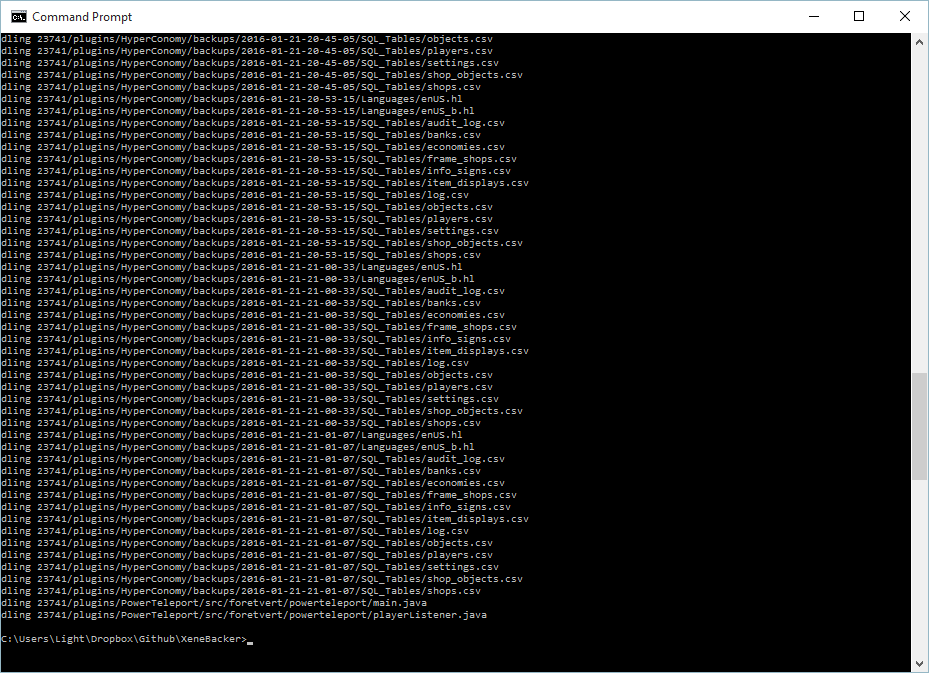

XeneBackup
-----
Update: Since the [Electron application](https://github.com/Xenecraft/Xene-FTP-Backup-Electron) has become a much cooler thing to pursue, I have taken to just updating that instead. You can use this as a simple command line assist-er. 

Since our server was going through some occasional funky saving issues, I wanted to write another failsafe that would make sure that our players' work and world are being saved. This backup program is a node.js application written to make periodic backups of our Minecraft server from its FTP! It includes a cronjob that can run periodically based on the time that you set for it.



Setup
-----
1. `npm install`
2. Create your own settings.js at the root for the config of the FTP:
	```json
	var CONNECTION_SETTINGS = {
		host: 'ftpIP',
		user: 'userAccount',
		password: 'passWord',
		port: 21
	};

	var COPY_PATH = {
		folderName: 'yourFTPFolder',
		destinationPath: 'whereYourFilesGo',
		ignoreFiles: ['.filetype', 'textinside', 'fullfile.name'],
	};

	var CRON_TIME = '00 00 3 * * 0-6';
	//this will run nightly at 3:00 AM every day

	module.exports = {CONNECTION_SETTINGS, COPY_PATH, CRON_TIME};

	```
3. `node test-call` or `node cronjob`

Packages used: 

ToDos:
-----
* Ability to extract log.gz files, do comparison, and send them to a directory
* Periodically delete other nights based on the frequency of backups
* Web interface for managing backups(??)

Extra Notes:
----
Feel free to use this for non-Minecraft uses too! This downloads all existing files from an FTP server so you could use it to back up other applications as well! As long as there are files and directories in your FTP folder, then it will take everything out and copy it to your desired destination!
